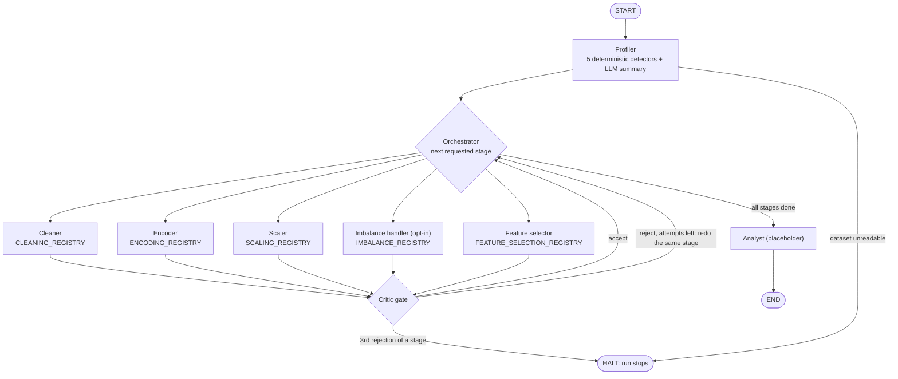

# Autonomous Preprocessing & Verification Agent

A LangGraph pipeline that cleans and preprocesses a messy tabular dataset in six stages, with a
**validation gate after every transforming stage**. LLMs only *choose* strategies from fixed
registries; Python applies them. The cleaning gate is a **QLoRA fine-tuned Llama 3.2 3B**,
evaluated against prompting and hybrid retrieval on 100 held-out examples.

| | |
|---|---|
| Fine-tuned validator, served locally (Ollama) | **0.98** accuracy on 100 held-out examples |
| Same model, prompted, same setup | **0.59** (always-"accept" baseline: 0.58) |
| Paired test, fine-tuned vs prompted | 40 vs 1 disagreements won, McNemar p < 0.0001 |
| Tests | 154, all mocked (no model needed), also run inside Docker |

---

## Architecture



(A redo goes straight back to the rejected stage; it is drawn via the orchestrator for readability.)

**Stage = registry + one generic runner.** Every stage filters its registry by preconditions
(`requires` / `handles`), shows the LLM only the options that fit, validates the key it returns,
and applies it through one shared dispatcher (`agents/dispatch.py`). If the LLM is down, returns an
unknown key, or picks a strategy that doesn't fit the data, a deterministic fallback takes the first
registry option that applies. Every decision records `chosen_by: llm | fallback`.

**Adding a technique = one registry entry.** The dispatcher, the stage code, the graph and the
prompts don't change: the prompt is built from the registry, and `CleaningDecision.action` is a plain
`str` validated against the registry at runtime (a `Literal` would have forced a schema edit too).

**The gate** (`agents/critic.py`) runs after every transforming stage:

1. **Hard checks** (Python): no before/after evidence, or more than 30% of rows removed in one step
   (duplicate removal exempt) → reject.
2. **Cleaning decisions** → LLM judgment on before/after column statistics, under a written policy
   (`agents/critic_policy.py`). The judge never sees the Cleaner's justification: it judges what the
   change *did*, not how it was argued.
3. **Other stages** → deterministic invariants (no rows lost, no new missing values). The LLM only
   judges the stage whose accuracy was measured.
4. One rejected decision rejects the stage; the stage is redone with the gate's reasons in its prompt.
   The cap is **3 attempts per stage**; the 3rd rejection halts the run before the next stage.
5. Unparseable LLM output → the decision passes **unverified** and is counted (never silently).

---

## Results

### Evaluation set

400 examples, built **without hand-labelling** (`evaluation/critic_dataset.py`, seed 42):
generate a clean synthetic table → inject one known corruption → run the **real detectors** → apply
one strategy (correct or deliberately wrong) through the **real dispatcher** → build the Critic's
input with the **same evidence builder** the live Critic uses → label it with the written policy.

- Split: 300 train / 100 test, stratified by scenario and label. Test: 58 accept / 42 reject.
- **25 of the 100 test examples are borderline** (|skew| within 0.7–1.3, or affected share within
  5–15%, around the policy thresholds) and are reported separately.
- The retrieval store and the fine-tuning data use the **train split only**; a test checks no overlap.

### Controlled comparison: all four conditions in one environment

Kaggle, Tesla T4, `meta-llama/Llama-3.2-3B-Instruct` @ `0cb88a4f`, 4-bit NF4, same prompt and
parser for all four rows (`notebooks/critic-qlora.ipynb`, results in `evaluation/results/kaggle_*.json`).

| Condition | Accuracy | Reject precision | Reject recall | Malformed | Lookup rules (1–2) | Threshold rules (3–8) |
|---|---|---|---|---|---|---|
| Prompted | 0.58 | 0.500 | 0.286 | 0.01 | 0.690 | 0.535 |
| Prompted + hybrid retrieval | 0.72 | 0.889 | 0.381 | 0.00 | 0.862 | 0.662 |
| **QLoRA fine-tuned** | **1.00** | **1.000** | **1.000** | 0.00 | 1.000 | 1.000 |
| Fine-tuned + hybrid retrieval | 0.86 | 0.889 | 0.762 | 0.00 | 0.966 | 0.817 |

Always-"accept" baseline: 0.58.

Paired McNemar tests on the same 100 rows (`evaluation/compare.py`, `evaluation/kaggle/comparisons.json`):

| Comparison | Rows only A got right / only B got right | p |
|---|---|---|
| Prompted → prompted + retrieval | 7 / 21 | 0.0125 |
| Prompted → fine-tuned | 0 / 42 | < 0.0001 |
| Fine-tuned → fine-tuned + retrieval | 14 / 0 | 0.0001 (retrieval **hurt**) |

### As served in the pipeline (local, Ollama)

| Critic | Accuracy | Reject precision | Reject recall | Malformed | Threshold rules |
|---|---|---|---|---|---|
| Prompted `llama3.2:3b` (tool calling) | 0.59 | 0.509 | 0.667 | 0.00 | 0.423 |
| Prompted + hybrid retrieval | 0.65 | 0.569 | 0.690 | 0.00 | 0.507 |
| **Fine-tuned `critic-ft` (in production)** | **0.98** | **0.976** | **0.976** | 0.00 | 0.972 |

- Prompted vs fine-tuned: 1 / 40, p < 0.0001. Prompted vs prompted + retrieval: 7 / 13, p = 0.26
  (not significant locally).
- Kaggle fine-tuned (1.00) vs local `critic-ft` (0.98): 2 / 0, p = 0.5, so no measurable loss from
  merging the adapter and re-quantizing to GGUF Q4_K_M.

### What the numbers say

1. **Prompting alone was unreliable**, measured twice in two different setups: 0.59 and 0.58,
   indistinguishable from always answering "accept". The prompted model got name-only rules right
   (`no_action` → reject) but failed rules that need a share computed and compared with a threshold.
2. **Fine-tuning fixed the task.** The fine-tuned model writes the computed share in its reason
   (e.g. *"rule 7: drop_rows_missing affected 9.4% <= 10%"* on a held-out example).
3. **Retrieval helps a prompted model but hurt the fine-tuned one.** The adapter was trained without
   retrieved context, so retrieved cases are out-of-distribution input: it sometimes copied a retrieved
   case's reason or verdict. To combine them, train with retrieved context. The live Critic therefore
   runs the fine-tuned model **without** retrieval, and the code enforces it.
4. **Malformed output was not the problem**: 1 in 700 judgments across all runs.

### Live pipeline runs (`data/raw/sample.csv`, 305 rows, 8 detected issues)

- **Prompted gate** (`docs/first_real_run.txt`): rejected the Cleaner 3 times with mostly wrong
  reasons (e.g. called a skew of −0.03 implausible) → **run halted**. False rejections compound:
  one rejected decision rejects the stage.
- **Fine-tuned gate** (`docs/finetuned_run.txt`): all four stages accepted on the first attempt.
  Re-applying the written policy to the 8 live cleaning decisions agrees **8/8**. The feature
  selector's LLM asked to drop 5 features; each drop strategy checks its own rule and refused, so
  the fallback kept them. This run shows the gate doesn't block good work; catching bad work is
  what the 100-row evaluation measures (reject recall 0.976).

### Fine-tuning setup

QLoRA on Kaggle T4: 4-bit NF4 base (double quantization, fp16 compute), LoRA r = 16, α = 32,
dropout 0.05 on `q,k,v,o,gate,up,down` projections → **24.3M trainable parameters (0.75%)**.
300 examples, 3 epochs, 57 steps, effective batch 16, lr 2e-4 cosine with warmup, loss only on the
answer tokens. Loss 1.33 → 0.004 in 22 minutes. Training log: `evaluation/kaggle/training_log.json`.

Serving: Ollama removed adapter loading, so the adapter was merged into the fp16 base
(`merge_and_unload`), checked (16/16 on test rows), converted to GGUF and quantized to Q4_K_M with
llama.cpp (`notebooks/critic-merge.ipynb`), then imported with `Modelfile`. The fine-tuned Critic is
prompted in the exact plain-JSON format it was trained on.

---

## Status

| Component | Status |
|---|---|
| Profiler: 5 deterministic detectors (duplicates, missing incl. placeholders, numbers/dates as text, IQR ∪ modified Z outliers, category variants) + LLM summary | Built, tested |
| Cleaner: 14 strategies, LLM choice + deterministic fallback, parquet snapshots | Built, tested |
| Encoder, scaler, feature selector, imbalance handler (one generic stage runner) | Built, tested |
| Critic gate: hard checks, per-stage redo cap, halt, unverified counting | Built, tested |
| Labelled dataset (400 examples, borderline cases) | Built |
| Prompted / retrieval / fine-tuned Critic evaluation | **Measured** (tables above) |
| Hybrid retrieval: ChromaDB dense + hand-written BM25 + hand-written Reciprocal Rank Fusion (k = 60) | Built, measured |
| QLoRA fine-tune, merged and served via Ollama as the live gate | Built, measured |
| FastAPI (`POST /pipeline/run`, path-traversal guard) | Built, tested (thin, synchronous) |
| MLflow logging of every evaluation run (idempotent) | Built |
| Docker image (pinned lock file, non-root user) running the full test suite | Built |
| Analyst agent | **Planned** (placeholder) |
| Per-decision Docker sandbox, downstream model-score check | **Planned** |
| Async job queue for the API, adaptive RAG, self-correction loop, live visual grid, deployment | **Planned** |

---

## Limitations (read before quoting numbers)

- **Synthetic, policy-labelled data.** Train and test come from the same generator and the same
  deterministic policy. 1.00 / 0.98 means the model learned *this task*; it is not evidence of
  accuracy on arbitrary real-world data. The live run on `sample.csv` (8/8) is one small check.
- **The policy is code**, so it could be applied without an LLM. The experiment measures whether a
  3B model can reliably apply a stated policy to structured evidence, the prerequisite for trusting it
  where rules don't cover a case. Part of the policy *is* enforced in code (the hard checks).
- **100 test rows** limit statistical power (local prompted vs retrieval was not significant).
- **No subtle corruptions:** the detectors flagged every injected corruption (0 discards).
- **Detector gaps:** impossible-but-in-range values (age −3) are not flagged; outlier *capping* uses
  IQR fences while detection uses IQR ∪ modified Z-score.
- **Target encoding** is fitted on the full data (leaks the target if you then train and evaluate on
  the same rows).
- **Serving differences:** the live model is merged into fp16 and re-quantized to Q4_K_M, and Ollama's
  chat template omits the training template's `Today Date` line. Measured effect: 1.00 → 0.98, p = 0.5.
- The API is synchronous: one request runs the whole pipeline (minutes with a local 3B model).

---

## Run it

```bash
python -m venv venv && source venv/bin/activate
pip install -r requirements.txt
python -m pytest -q                      # 154 tests, no model needed
python scripts/make_sample_data.py       # data/raw/sample.csv
python main.py                           # needs Ollama running (see .env.example)
```

Key settings (`.env`, see `.env.example`): `LLM_PROVIDER=ollama`, `OLLAMA_MODEL=llama3.2:3b`,
`CRITIC_MODEL=critic-ft` (empty = prompted Critic), `CRITIC_RETRIEVAL=true|false` (prompted Critic only).

```bash
python -m evaluation.critic_dataset                           # rebuild the 400-example dataset
python -m evaluation.run_critic_eval                          # evaluate the configured Critic
python -m evaluation.compare prompted_ollama finetuned_ollama  # paired McNemar test
python -m evaluation.log_to_mlflow                            # log results; mlflow ui --backend-store-uri sqlite:///mlflow.db
uvicorn api.main:app                                          # API docs at http://127.0.0.1:8000/docs
docker build -t preprocessing-agent .
docker run --rm preprocessing-agent python -m pytest -q
```

`critic-ft` is built from the LoRA adapter produced by `notebooks/critic-qlora.ipynb`, merged and
converted by `notebooks/critic-merge.ipynb`, then `ollama create critic-ft -f Modelfile`. Model
weights are not committed.

Built with Llama. Llama 3.2 is licensed under the Llama 3.2 Community License, Copyright © Meta
Platforms, Inc. All Rights Reserved.
